# Customer Intelligence & Retention Analytics Platform

An end-to-end data-science project that turns e-commerce transactions into **customer segments, churn probabilities, explanations and a prioritised retention worklist**, shown in an interactive Streamlit dashboard.

> **What the project is:** a standardized, dataset-agnostic analytics and machine-learning pipeline with configurable adapters for different e-commerce datasets.
> The modelling and analytics pipeline operates on a standardized schema, allowing it to be reused across different e-commerce datasets. Dataset-specific differences are handled by the input adapter.
>
> **What it is not:** it does not claim to work on *any* dataset. It needs a transaction table with customer, order, date, quantity and price (see [Using your own dataset](#using-your-own-dataset)), and it stops with a clear message when the data cannot support a time-based churn evaluation.
>
> **Synthetic vs real:** the bundled datasets are **simulated**. Every number in the "Example results" section below comes from them and demonstrates the *method*, not the behaviour of any real business.

```
Raw file(s)  ->  YAML adapter config  ->  Standardized customer + transaction tables  ->  Validation report
   ->  Cleaning  ->  Features  ->  RFM  ->  Segmentation  ->  Churn definition  ->  Model (selected on validation)
   ->  Test once  ->  SHAP  ->  Prioritisation  ->  Dashboard
```

---

## Real public validation: UCI Online Retail II

The pipeline was also run end-to-end on the public UCI Online Retail II dataset. This provides a real-world validation example while keeping the raw dataset outside the repository.

| Metric | Result |
|---|---:|
| Date range | 2009-12-01 to 2011-12-09 |
| Rows read | 1,067,371 |
| Rows retained | 794,163 |
| Identified customers | 5,852 |
| Purchase orders | 36,594 |
| Retained order lines | 776,577 |
| Returns / cancellations | 17,586 |
| Derived churn window | **180 days** |
| P95 purchase gap | 221 days |
| Selected model | **Gradient Boosting** |
| Validation PR-AUC | **0.732** |
| Test ROC-AUC | **0.783** |
| Test PR-AUC | **0.568** |
| Test precision | **0.453** |
| Test recall | **0.828** |
| Test F1 | **0.586** |

### Model selection

The model was selected using **validation PR-AUC only**. Gradient Boosting achieved a validation PR-AUC of **0.732**, narrowly outperforming Logistic Regression with all available features (**0.730**).

The test set was used once for final evaluation and did not influence model selection.

### Dataset-specific limitations

The UCI dataset does not provide customer registration dates, demographics, payment methods, product categories or discount information. These fields are therefore reported as unavailable rather than fabricated.

Rows without a Customer ID are excluded from customer-level analytics and are reported in the cleaning summary.

## Dashboard preview

The project includes an interactive Streamlit dashboard for exploring customer behaviour, RFM segmentation, customer clusters, churn risk, model explanations, and retention priorities.

### Overview

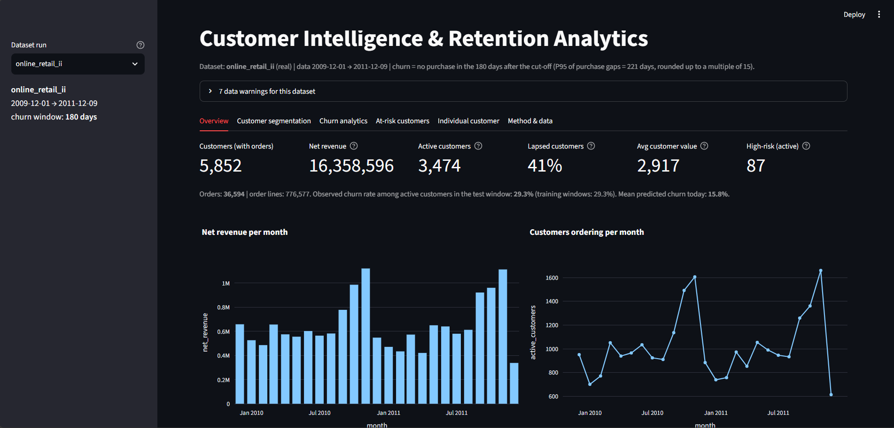

### RFM segmentation

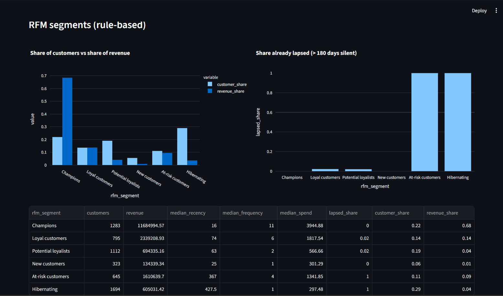

### Customer clustering

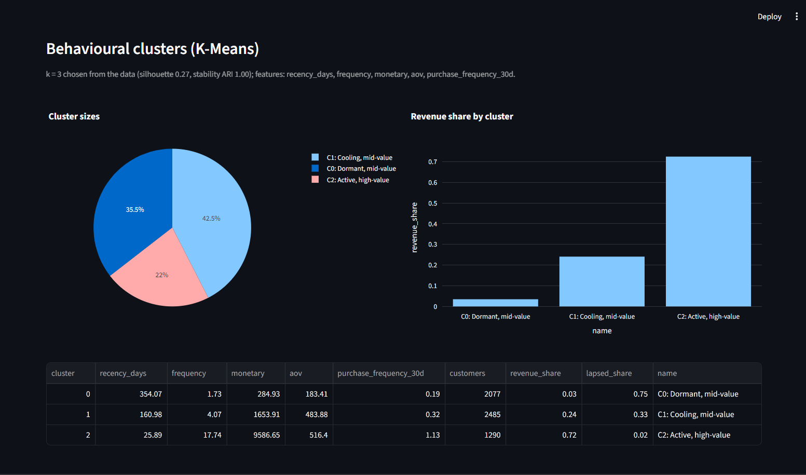

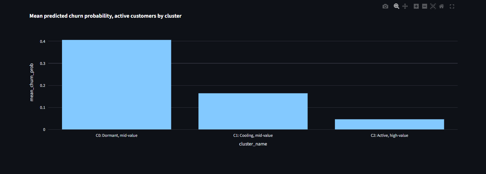

### Churn analytics

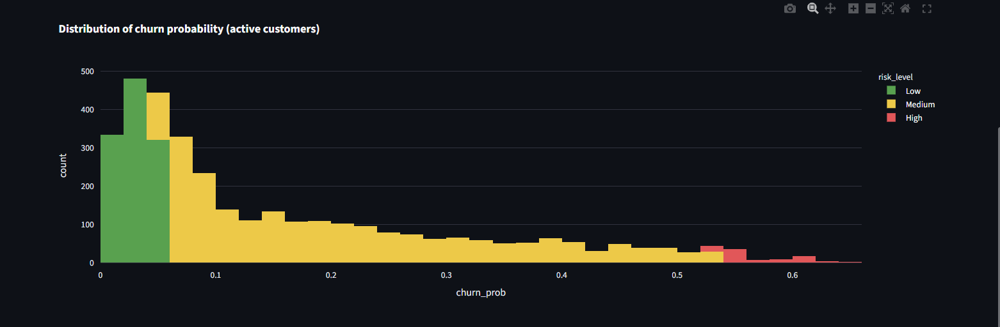

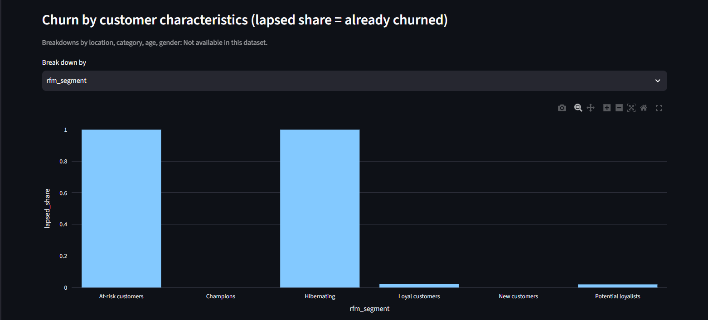

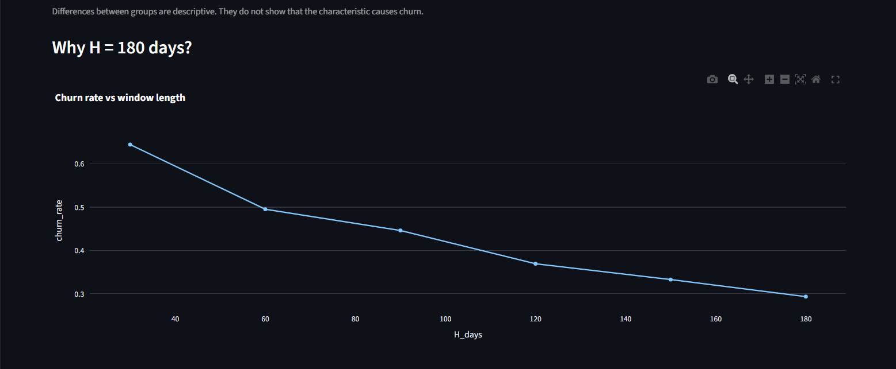

### Model evaluation

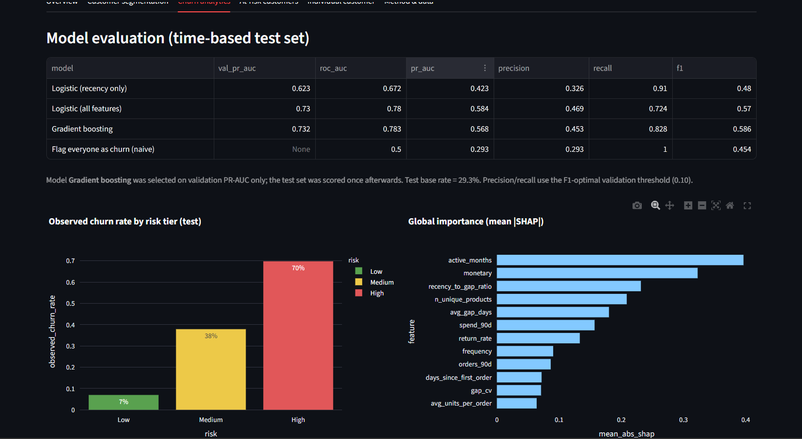

### Retention prioritisation

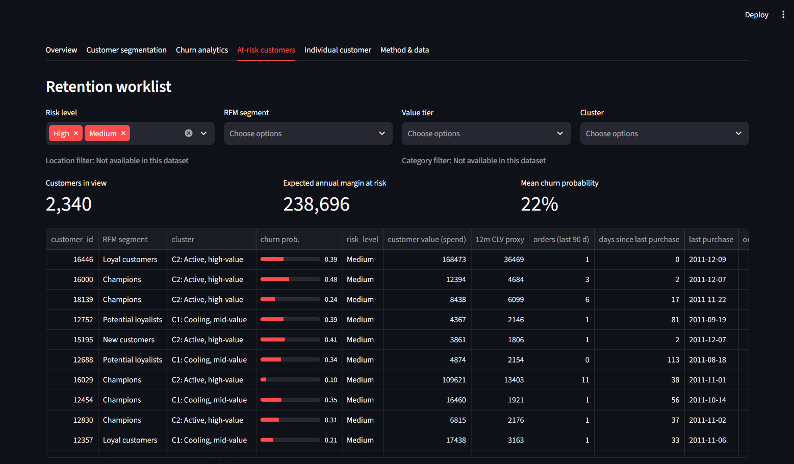

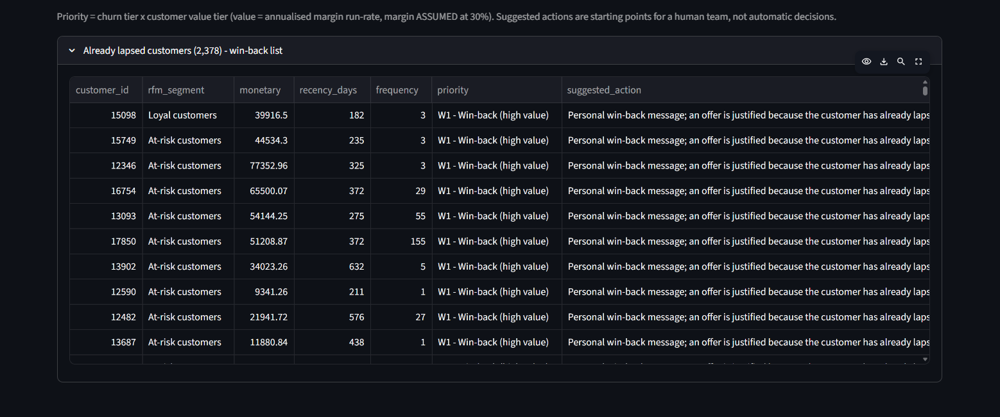

### Individual customer analysis

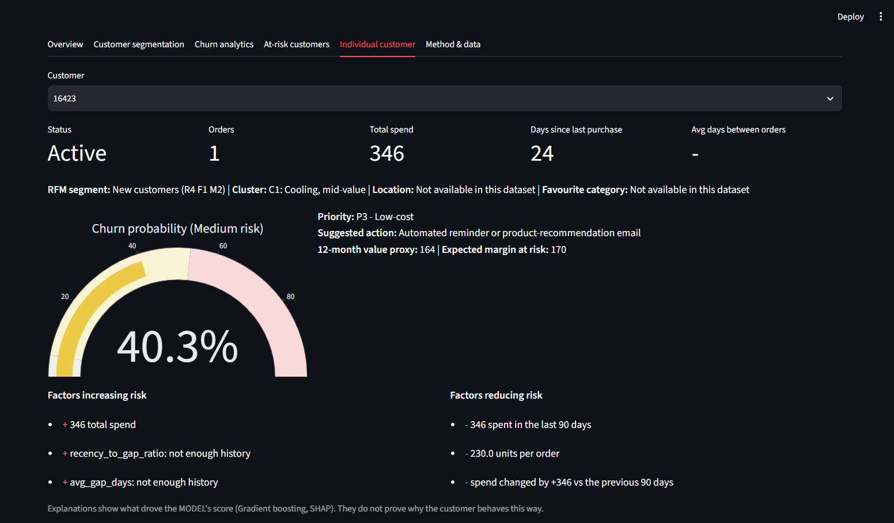

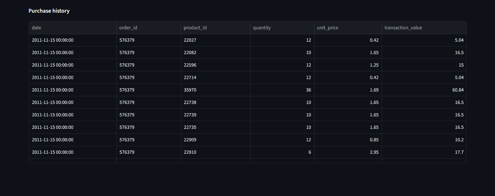

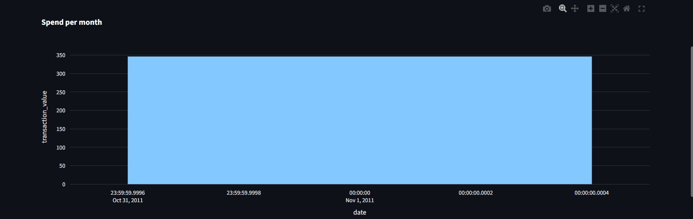


## 1. Architecture: raw data / adapter / pipeline

| Layer | Code | Knows about |
|---|---|---|
| **Raw dataset** | your CSV / XLSX / parquet file(s) | its own column names, return convention, date format |
| **Adapter** | `src/adapter.py` + `configs/<dataset>.yaml` | maps raw columns to the canonical schema, flags returns, scales discounts, filters non-product lines, derives the customer table if missing |
| **Canonical schema** | `src/schema.py` | `customer_id, order_id, transaction_id, date, product_id, product_name, category, quantity, unit_price, discount, payment_method, is_return` + optional `customer_registration_date / age / gender / location` |
| **Validation** | `src/validation.py` | required fields, missing values, returns, date range, churn window, history, target quality: errors and warnings *before* modelling |
| **Pipeline** | `src/data_processing.py`, `feature_engineering.py`, `segmentation.py`, `churn_model.py`, `evaluation.py`, `explainability.py`, `prioritization.py`, `eda.py`, `pipeline.py` | **only canonical names**. No raw column name, calendar date or dataset size is hard-coded |
| **Outputs** | `data/processed/` (default run) or `data/runs/<run>/` | metrics, scored customers, `run_metadata.json` (dates, window, thresholds, available fields) |
| **Dashboard / notebooks** | `dashboard/app.py`, `notebooks/` | read the outputs of one run; unavailable fields show "Not available in this dataset" |

## 2. Quick start

```bash
python -m venv .venv && source .venv/bin/activate      # Windows: .venv\Scripts\activate
pip install -r requirements.txt

# A. built-in SYNTHETIC demo (customers + transactions tables, 2024-2025)
python -m src.generate_data
python -m src.pipeline                                  # uses configs/synthetic.yaml -> data/processed/

# B. second, structurally different dataset (SIMULATED, shipped in examples/): one table, other column names,
#    "C"-prefixed cancellations, no category / discount / customer table, 2009-2011
python -m src.pipeline --config configs/retail_style_fixture.yaml      # -> data/runs/retail_style_fixture/

# C. dashboard (choose the run in the sidebar)
streamlit run dashboard/app.py

pytest -q                                                # 47 tests
python scripts/build_notebooks.py                        # optional: execute the 6 notebooks for the default run
```

## 3. Using your own dataset

You can bring a reasonably structured e-commerce transaction file (for example one provided by a recruiter) without touching the modelling code.

**1. Required fields** (one row per order line)
`customer_id`, `order_id` (one purchase event / invoice / basket; if only a per-row id exists, map it to `transaction_id` and each row is treated as one order), `date`, `quantity`, `unit_price`.

**2. Optional fields.** `transaction_id, product_id, product_name, category, discount, payment_method`, and (customer table) `customer_registration_date, customer_age, customer_gender, customer_location`. None is required. Behaviour when absent:

| Missing field | What happens |
|---|---|
| customer table | derived from transactions; demographics = Unknown (**never fabricated**) |
| registration date | approximated by the first purchase date (documented approximation); the redundant feature `days_since_registration` is excluded |
| discount | set to 0 meaning *"discount information unavailable"* (not "no discounts"); `discount_available = False` in the run metadata; discount features excluded |
| category | category features and "favourite category" excluded; dashboard shows "Not available in this dataset" |
| product id | "distinct products" feature excluded |
| age / gender / location | filters and breakdowns hidden and labelled *Not available* |

Features are also dropped automatically if they are empty or constant in the training data. The list of used / excluded features and the reason is stored in `run_metadata.json` and shown in the dashboard.

**3. Create the adapter config.** Copy [`configs/template.yaml`](configs/template.yaml) (every option is commented) and map your columns:

```yaml
name: my_shop
kind: real
run: my_shop
source: {transactions: ["data/external/my_transactions.csv"]}
columns:
  customer_id: "Customer ID"
  order_id:    "Invoice"
  date:        "InvoiceDate"
  product_id:  "StockCode"
  quantity:    "Quantity"
  unit_price:  "Price"
  category: null        # not available
  discount: null        # not available
returns:
  method: id_prefix     # cancellations have invoice numbers starting with C
  column: "Invoice"
  prefixes: ["C"]
```

**4. Return / cancellation handling** (`returns.method`): `negative_quantity`, `id_prefix` (+`prefixes`), `flag_column` (+`column`, `values`; refunds with positive quantity are negated), `none`, `auto` (detects a letter-prefix or plain-negative convention and reports what it chose), plus an optional separate returns table (`source.returns`). Valid returns are **kept and flagged**, never silently dropped; they reduce net revenue but are not purchases. Negative quantities that match *no* rule are dropped and **counted with the reason**, and the validation report warns if there are many of them (a sign that the return rule is wrong).

**5. Dates** are inferred from the cleaned transactions (first / last day). Mixed or non-ISO formats are parsed (use `date_format` / `dayfirst` for ambiguous ones). A manual window can be forced with `analysis.data_start / data_end`.

**6. The churn window is derived from the data**: gaps between consecutive orders of the same customer -> the 95th percentile (configurable) -> rounded up to a multiple of 15 -> kept inside a safety range (30-180 days) -> recorded in the run metadata. It is recomputed for every dataset (`analysis.churn_window_days` overrides it). The validation step also checks that the resulting target has enough churned/retained customers in train/validation/test, and warns if the churn rate is extreme or changes a lot for neighbouring windows.

**7. Minimum recommended history.** The time-based split needs `120 days of observation + 3 training cut-offs + 3 consecutive churn windows`, i.e. about **15 months for a 90-day window, 18 months for 120 days, 24 months for 180 days**. If the data is shorter the run stops with, for example: *"The dataset contains only 8 months of history ... At least approximately 15 months are recommended for a churn horizon of 90 days."* At least ~50 customers and 200 repeat-purchase gaps are also required (otherwise set the window manually).

**8. Run it**

```bash
python -m src.pipeline --config configs/my_shop.yaml --validate-only   # mapping, cleaning counts, window, history check
python -m src.pipeline --config configs/my_shop.yaml                   # full run -> data/runs/my_shop/
python -m src.pipeline --config configs/my_shop.yaml --input other.csv # override the input file(s)
python scripts/build_notebooks.py --run my_shop --out notebooks_my_shop   # optional: notebooks for that run
CIP_RUN=my_shop streamlit run dashboard/app.py                         # or pick the run in the sidebar
```

Typical errors are explained, e.g. `column 'Price' (mapped to 'unit_price') not found in the file. Did you mean: ['price']?`

**9. Real public example: UCI Online Retail II.** [`configs/online_retail_ii.yaml`](configs/online_retail_ii.yaml) documents the mapping (`Invoice -> order_id`, `StockCode -> product_id`, `Description -> product_name`, `InvoiceDate -> date`, `Price -> unit_price`, `Customer ID -> customer_id`; cancellations = invoice prefix `C`; no customer table, category or discount; non-product codes such as `POST` filtered; rows without Customer ID excluded and reported). Download `online_retail_II.xlsx` from the [UCI page](https://archive.ics.uci.edu/dataset/502/online+retail+ii) (check its licence), put it in `data/external/` and run `python -m src.pipeline --config configs/online_retail_ii.yaml --validate-only`.
**Honesty note:** the build environment could not download that file. The mapping follows the published schema and was exercised end-to-end on a simulated stand-in with the same structure (`examples/retail_style_fixture/`, see [its README](examples/retail_style_fixture/README.md)); it has **not** been run on the real file.

## 4. Methodology and the reasoning behind each decision

| Step | Decision | Why |
|---|---|---|
| **Cleaning** | Every decision is logged ([`cleaning_log.csv`](data/processed/cleaning_log.csv)) together with a summary: purchase lines kept, returns kept, rows removed and the reason for each removal | Unusual values are investigated first; repairs preferred to deletion; nothing is dropped silently |
| **Churn window H** | Derived per dataset (see 3.6) | A normal customer should rarely be silent longer than H; not a copied constant |
| **Churn label** | At cut-off T an *active* customer (last order <= H days ago) is churned if they place **no order in (T, T+H]** | Customers silent > H days are already churned by definition |
| **No leakage** | Features use only rows dated <= T; cut-offs, H and the end of the data come from the dataset; `build_snapshot` refuses labels beyond the last day of data | The most common way churn projects overstate performance |
| **Split** | Chronological: training cut-offs every `snapshot_step_days`, then validation = last training cut-off + H, test = validation + H, test labels end exactly at the last day of data | The test set is a genuine future |
| **Model selection** | 3 candidates (logistic on recency only; logistic on all available features; tuned gradient boosting). `run_modeling()` receives **train and validation only** and selects by the configured *validation* metric (`pr_auc` default); `evaluate_on_test()` is the only function that sees the test set and cannot change the choice | Test data must not influence any decision |
| **Metrics** | ROC-AUC, PR-AUC, precision, recall, F1, Brier, confusion matrix, calibration, decile lift; naive "flag everyone" benchmark | Accuracy is misleading when churn is a minority |
| **Risk tiers** | Computed from the **validation** outcomes of this run: High = lowest score where the flagged group churns at >= 2x the validation base rate (capped at 90%); Low = highest score where <= 15% churn; Medium between. The exact rule, base rate and thresholds are written to the metadata and shown in the dashboard; if the data cannot support the rule, the quantile fallback is flagged | Thresholds adapt to each dataset's base rate |
| **RFM** | Quintile scores from percentile ranks (ties share a score); rule-based segments; empty segments simply do not appear; a warning is raised when most customers bought once (Frequency then carries little information) | Labels are shown only when the data supports them |
| **Clustering** | log1p -> winsorise -> standardise -> K-Means; k chosen from an evaluated range (3-6 preferred) as the smallest k within 10% of the best silhouette; stability (ARI) reported; skipped with a warning below 100 customers | Not simply argmax(silhouette) |
| **Explainability** | SHAP for whichever model is selected (exact tree explainer for boosting; model-agnostic permutation explainer for the logistic pipeline) + permutation importance. A test checks `base + sum(SHAP) = model log-odds` | Explanations describe the *model*, never causes |
| **Prioritisation** | risk tier x value tier -> priority and *suggested* action; expected margin at risk = annual margin run-rate x churn probability; CLV is a heuristic proxy with an **assumed** margin (`business.gross_margin`) | Spend effort where risk and value coincide; do not discount customers who would stay |

## 5. Example results (SYNTHETIC / SIMULATED data only)

> These numbers are outputs of `python -m src.pipeline` on the **synthetic demo** and `configs/retail_style_fixture.yaml` on the **simulated stand-in**. They show what the pipeline produces; they say nothing about real customers. Your own run writes its numbers to `data/runs/<run>/processed/` and to the dashboard.

| | Synthetic demo (`configs/synthetic.yaml`) | Simulated Online-Retail-style (`configs/retail_style_fixture.yaml`) |
|---|---|---|
| Schema | customers + transactions tables | **one** table, other column names, no category / discount / demographics |
| Returns convention | order id prefix `R` | invoice prefix `C` |
| Date range (inferred) | 2024-01-01 -> 2025-12-31 | 2009-12-01 -> 2011-12-08 |
| Customers / orders | 5,999 / 60,575 | 2,000 / 18,144 |
| Rows read -> kept | 147,967 -> 145,704 | 157,522 -> 133,235 (18,679 without Customer ID, 2,753 postage/fee lines, 2,855 duplicates) |
| Derived churn window | **90 days** (P95 of gaps = 87) | **120 days** (P95 of gaps = 116) |
| Churn rate train / val / test | 25.4% / 27.3% / 20.1% | 30.1% / 27.0% / 22.8% |
| Features used | 25 | 21 (`n_unique_categories`, `avg_discount`, `discount_order_share`, `days_since_registration` excluded: unavailable) |
| Model selected on validation PR-AUC | Gradient boosting (0.492) | Logistic, all features (0.547) |
| Test ROC-AUC / PR-AUC of selected model | 0.758 / 0.421 (base rate 0.201) | 0.754 / 0.509 (base rate 0.228) |
| Risk tiers (observed test churn Low / Medium / High) | 9.9% / 30.4% / 47.6% | 12.2% / 29.5% / 52.6% |
| K-Means k / silhouette | 3 / 0.30 | 3 / 0.37 |

Things worth reading honestly in these tables:
* On the second dataset gradient boosting scored a *higher test* PR-AUC (0.564) than the logistic model that validation selected (0.509). The pipeline keeps the validation choice on purpose: switching to the test winner would turn the test set into a model-selection tool and overstate performance.
* Performance is modest in both (ROC-AUC ~0.75); recency alone already carries most of the signal (recency-only logistic: ROC-AUC 0.71 / 0.73). A simple "silent for N days" rule is a strong baseline.
* Predicted probabilities run above observed rates in the test period because the churn rate fell between training and test (dataset shift). The dashboard states this whenever the train/test rates differ by more than 3 points.

Synthetic-demo extras (also simulated): the top 20% of customers generate 69% of revenue; 86% of customers bought at least twice; RFM "Champions" are 24% of customers and 65% of revenue; the three K-Means clusters are Active/high-value (1,743 customers, 75% of revenue), Cooling/mid-value (2,523) and Dormant/low-value (1,733); 58 active customers are both High-risk and High-value (priority P1).

Figures for each run are written to `reports/figures/` (default) or `data/runs/<run>/figures/` (21 figures: trends, distributions, churn-window evidence, cohorts, RFM, clusters, ROC/PR, calibration, risk tiers, SHAP).

## 6. Dashboard

`streamlit run dashboard/app.py`. Sidebar: choose the dataset run. Tabs: **Overview** (customers, orders, revenue, lapsed share, high-risk count, dates), **Customer segmentation** (RFM, clusters, warnings), **Churn analytics** (model table, risk tiers *with the rule and thresholds of the run*, SHAP, breakdowns, window sensitivity, excluded features), **At-risk customers** (filterable worklist, CSV export, win-back list), **Individual customer** (history, churn gauge, risk-increasing / reducing factors, suggested action), **Method & data** (validation checks, column mapping, cleaning log). Filters/breakdowns that need an unavailable field are replaced by "Not available in this dataset". A banner marks simulated data. The repository includes screenshots of the dashboard using the real UCI Online Retail II run. The app is also smoke-tested programmatically on both datasets with Streamlit's `AppTest`.

## 7. Tests (`pytest -q`, 48 tests)

| File | What it proves |
|---|---|
| `test_adapter_schema.py` | arbitrary column names map to the canonical schema; missing required fields are detected with suggestions; optional fields absent are flagged, not invented; derived customer table; separate returns table; `extends`, csv/xlsx reading; all shipped configs load |
| `test_cleaning_returns.py` | missing ids, duplicates, invalid dates / quantities / prices, percent discounts; returns kept under every convention (flag column, prefix, negative quantity, auto); wrong return rule is reported not hidden; returns never count as purchases; row accounting adds up |
| `test_temporal_and_leakage.py` | dates inferred; churn window recomputed per dataset and equals the documented rule; split chronological for arbitrary dates; short history fails with the clear message; no labels beyond the data; **tampering with / deleting the future leaves past features identical**; labels depend only on (T, T+H]; labels never in the features; **same-day orders do not create zero-day interpurchase gaps** |
| `test_models.py` | selection uses validation only; changing test labels changes test metrics but not the selection, thresholds or models; scaler/imputer fitted on train; works with reduced feature sets; unavailable features excluded; SHAP reproduces the selected model's output (tree and linear paths) |
| `test_portability_e2e.py` | the **full pipeline and the dashboard run on the second dataset**; window, dates, excluded features and risk rule come from that dataset; broken config -> readable message, exit code 2; no synthetic-specific literals in the pipeline code |
| `test_reproducibility.py` | the second dataset reproduces identical metrics; fixture generator deterministic |

The three unit-test schemas (tiny test data, retail-style fixture, synthetic demo) differ in column names, date formats, discount scale, return convention and optional fields on purpose.

## 8. Reproducibility

* Seed 42 everywhere (`modeling.seed`). From an empty `data/` folder: `python -m src.generate_data && python -m src.pipeline` reproduces identical metrics (verified; the refactor to the adapter architecture left every metric of the original synthetic pipeline unchanged).
* Real data: the same file + config + seed gives the same results (tested on the second dataset).
* Unavoidable nondeterminism: none known on the same machine; different library versions (see `requirements.txt`) or platforms can change low-order digits of gradient-boosting and SHAP outputs.

```
configs/        template.yaml, synthetic.yaml, online_retail_ii.yaml, retail_style_fixture.yaml
data/           raw/ (synthetic generator output)  external/ (put real files here)  standardized/  processed/  runs/<run>/
examples/       retail_style_fixture/ (simulated, Online-Retail-shaped)
src/            config, schema, adapter, data_processing, validation, feature_engineering, segmentation, churn_model,
                evaluation, explainability, prioritization, eda, pipeline, sql_analytics, generate_data
dashboard/app.py   notebooks/ (6)   sql/queries.sql   scripts/ (notebook builder, fixture generator)   tests/ (48)   models/
```

## 9. Limitations (please read)

* **Not "any dataset".** Needs customer, order, date, quantity and price per line, enough customers/repeat purchases and roughly 15+ months of history (see 3.7). Only formats readable by pandas (csv, tsv, xlsx, parquet) are supported. Fixes for ambiguous date formats, unusual return conventions, multi-currency or multi-table schemas must be declared in the YAML config (or need a small code extension).
* **UCI Online Retail II is a public validation dataset, not production data.** The repository does not redistribute the raw dataset; users should obtain it from the original source and place it under `data/external/` according to the documented configuration.
* **Simulated demo data** with known mechanisms: reported performance is not evidence about real customers.
* **Churn is defined by inactivity**, a proxy for "has left". Seasonal or very infrequent buyers can look churned; one window per dataset ignores differences between product categories. The gap distribution is right-censored, so the derived window is probably slightly optimistic.
* **Guest checkouts and rows without a customer id are excluded** (reported); revenue totals therefore cover identified customers only. Exact-duplicate removal is on by default and can wrongly remove legitimately repeated lines (switch it off in the config).
* **Dataset shift** between training and test windows (seasonality) makes probabilities less calibrated; production use needs monitoring and recalibration.
* **Explanations are not causes.** Only an A/B test can show whether an intervention changes behaviour. There is no uplift model.
* **Value / CLV are proxies**: flat assumed margin (`business.gross_margin`), constant per-window churn probability, run-rate extrapolation; intervention costs in the notebook trade-off table are illustrative.
* **No fairness audit.** Demographics are never used by the model, but proxies may remain.
* Customers with little history have NaN / unreliable behavioural features (tree model handles NaN; logistic imputes the median with a missing-indicator).

## 10. Future improvements
Probabilistic CLV (BG/NBD + Gamma-Gamma) and survival analysis; per-category purchase cycles; calibration (isotonic) and scheduled retraining; A/B testing of retention actions and uplift modelling; fairness review; a FastAPI scoring service and model monitoring (PSI, calibration drift); deployment.

## Author

**Hiba Hedhli**

LMI Student — Mathematics & Computer Science

- LinkedIn: [https://www.linkedin.com/in/hibahedhli/]
